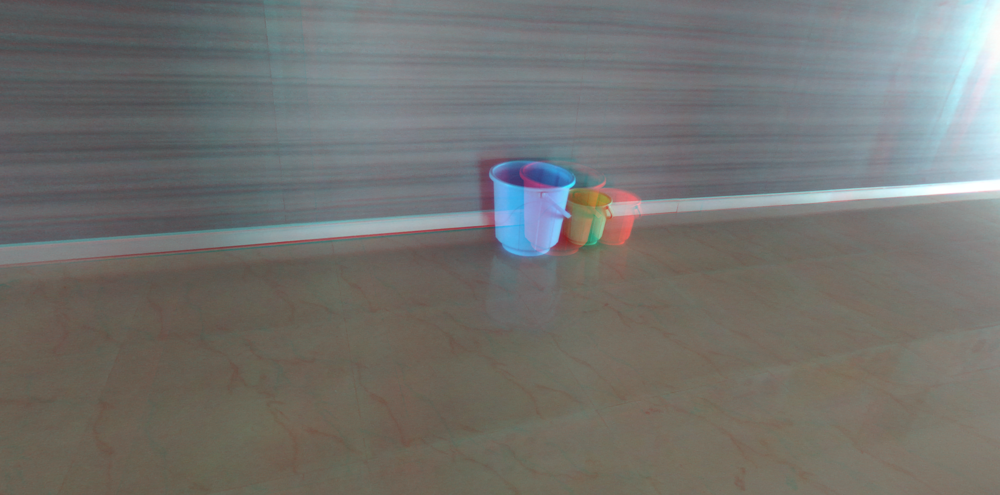
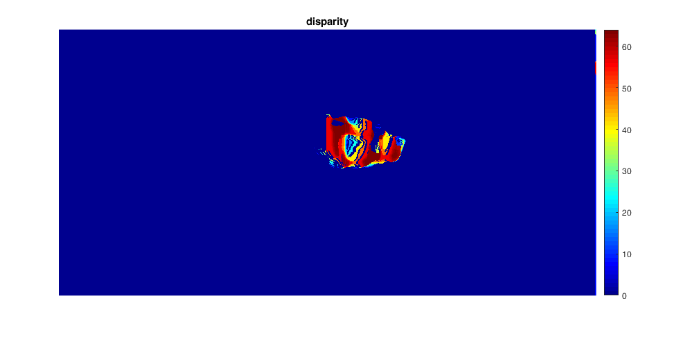

# Pointcloud_MATLAB

This is a MATLAB workflow to generate a disparity map and consequently a 3D point cloud from the images from a stereo camera. Here the popular [StereoLabs ZED camera](https://www.stereolabs.com/zed/) was used to capture the stereo images.

Though this specific camera comes with an API to compute the disparity map and 3D point cloud, the aim was make a generalized workflow that could be implemented to any stereo camera.

## Disparity Map and 3D Point Cloud

The **_disparity of features_** between 2 stereo images are usually computed as shift to the left of an image feature when viewed in the right image. Through the process of **_image rectification_**, both images are rotated to allow for disparities in only the horizontal direction(i.e. there is no disparity in the y image coordinates).

After rectification, the correspondence made by using an algorithm that scans both the left and right images for matching image features. Block matching approach is used he for the purpose of feature matching.

Once we have the notion of disparity, it is very easy to perceive depth. In general disparity and depth are inversely related. As the distance from the camera increases, the disparity decreases. This allows for depth perception in stereo images. Using geometry and algebra, the points that appear in the 2D stereo images can be mapped as coordinates in 3D space.

Thus 3D Point Clouds of a scene can be extracted from disparity maps pretty accurately using some mathematical transforms.

This concept is particularly useful in navigation. For example, the Mars Exploration Rover uses a similar method for scanning the terrain for obstacles. It is also a field of research in the development of Autonomous Vehicles to eliminate the use of LIDAR's.

Though there has been a lot of research and much more advance techniques using Neural Networks have been developed for 3D depth perception, the basics remain the same. This workflow has been made to get a basic understanding on how 3D depth perception works.

## The workflow
### Camera Calibration
Before starting the process of disparity extraction we first calibrate the stereo camera.
Here calibration does not mean any physical changes to camera. Its a calibration for the algorithm to know the different parameters about the camera, mainly dealing with the physical distance between the 2 cameras.

We use the Stereo Camera Calibrator app in MATLAB for calibrating the camera and importing the parameters to our main workspace.

* Open the app from under the "APPS" tab
* For calibration we require 20-25 stereo images of a chessboard pattern, taken from the to be calibrated camera from different angles.

  
* Divide the images into 2 and put all the images from the left camera in one folder and from the right camera in one folder. Remember to keep the name of each corresponding image the same.
* Import the images into the app using the "Add Images" button
* Click the "Calibrate" button

  

  

  
* Once calibrated export the parameters into the workspace using "stereoParams" as the variable name

### Input
* An image from a stereo camera is given as input

  
### Rectification, Disparity Map and the Point Cloud
* Once the "stereoParams" has been imported run following command in the MATLAB command window
  ```bash
  pointcloud.m
  ```
* Rectified image is computed and displayed using the following
  ```matlab
  [LeftRect, RightRect] = rectifyStereoImages(left, right, stereoParams, 'OutputView', 'valid');

  figure;
  imtool(stereoAnaglyph(LeftRect, RightRect));
  ```
Output -

  
* The disparity map is computed and plotted using the following
  ```matlab
  leftgray = rgb2gray(LeftRect);
  rightgray = rgb2gray(RightRect);
  disparitymap = disparity(leftgray, rightgray, 'BlockSize', 53);

  figure;
  imshow(disparitymap, [0, 64]);
  title('disparity');
  colormap jet
  colorbar
  ```
Output -

  
* Finally, a 3D point cloud is made using the disparity map and saved as "pointcloud.ply" using the following
  ```matlab
  points3D = reconstructScene(disparitymap, stereoParams);

  points3D = points3D./1000;
  ptCloud = pointCloud(points3D, 'Color', LeftRect);

  pcwrite(ptCloud, 'pointcloud');
  ```
### Output

Thus we generated a 3D point cloud out of an image from a stereo camera image. The 3D point cloud can be viewed with any 3D format supporting software such as MeshLab.
